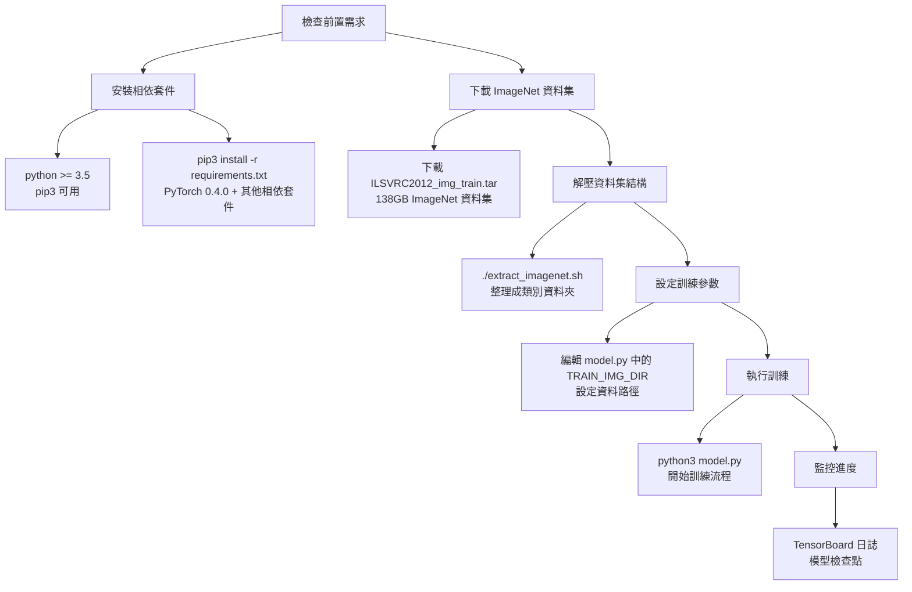
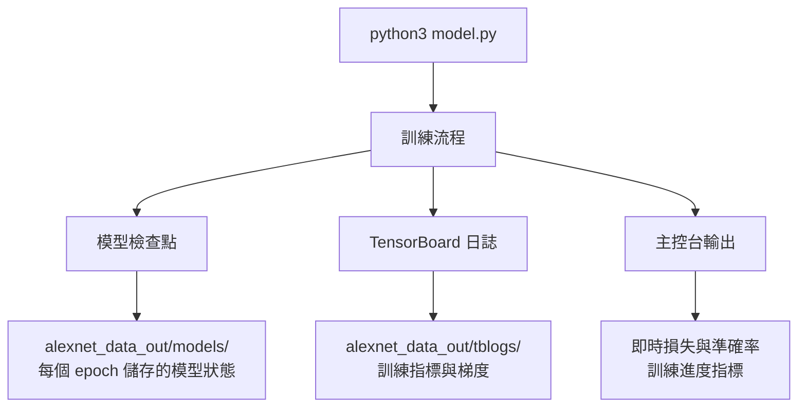

## 快速開始

這份指南提供完整的設定步驟，用於 AlexNet PyTorch 實作，涵蓋相依套件安裝、資料集準備以及執行首次訓練。  
此流程包含設定 Python 3.5+ 環境與 PyTorch 0.4.0，準備 138GB ImageNet 2012 資料集，並設定訓練參數。

如需資料處理工具的詳細資訊，請參考 [資料集處理](#)。  
如需開發環境與執行框架的詳細資訊，請參考 [開發環境](#)。

---

## 安裝概覽

快速開始流程遵循一個循序的工作流程，幫助你在訓練前準備好環境、資料及相關設定：

---

## 安裝工作流程

（此處可依需求補充圖表或步驟細節）




來源：
- `README.md` 第 9–43 行

---

## 環境需求

系統需要 Python 3.5 或更高版本，並且需要特定版本的 PyTorch 以確保相容性。這些相依套件都已固定版本，以保證與原始實作結果的一致性：

| 組件         | 版本    | 用途                     |
|--------------|---------|------------------------|
| `python`     | >= 3.5  | 執行環境               |
| `torch`      | 0.4.0   | 核心 PyTorch 框架      |
| `torchvision` | 0.2.1 | 電腦視覺工具集         |
| `tensorboardX` | 1.2   | 實驗追蹤              |
| `numpy`      | 1.22.0 | 數值運算              |
| `Pillow`     | 9.0.1  | 影像處理              |

---

請使用提供的 `requirements.txt` 檔案安裝所有相依套件：

```bash
pip3 install -r requirements.txt
```

來源：
- requirements.txt 第 1–7 行
- README.md 第 11–18 行


## 資料集準備
此實作需要 ImageNet 2012 資料集（ILSVRC2012），因為 AlexNet 的輸入尺寸需求為 227×227 像素。
像 Tiny ImageNet 或 MNIST 這種較小的資料集因影像尺寸不足，無法使用。


## 資料集要求


```mermaid
flowchart TD
    A[ILSVRC2012_img_train.tar] --> B[extract_imagenet.sh]
    A --> C[138GB 壓縮檔案]

    B --> D[已組織的目錄結構]
    C --> E[Shell 解壓腳本]
    E --> D

    D --> F[torchvision.ImageFolder 相容]
    D --> G[/root/[class]/[img_id].jpeg<br>依類別組織]

    F --> H[可直接與 PyTorch 資料載入器整合]
```


下載 `ILSVRC2012_img_train.tar` 後，執行以下指令以解壓資料集結構：

```bash
./extract_imagenet.sh
```

解壓後會建立一個目錄階層，每個類別都會有自己的子資料夾，內含訓練圖片，這使其能直接相容於 `torchvision.datasets.ImageFolder`。

來源：
- `README.md` 第 20–33 行


## 設定與訓練執行

訓練系統透過在 `model.py` 開頭定義的常數進行控制。主要需要設定的配置為資料集路徑。


### 主要設定參數

在執行訓練前，請修改 `model.py` 中的 `TRAIN_IMG_DIR` 常數，指向你已解壓的 ImageNet 資料夾位置。其他模型參數也可以在檔案開頭的常數中進一步調整。


## 開始訓練

透過以下指令執行訓練流程：

```bash
python3 model.py
```

此指令會啟動完整的 AlexNet 訓練流程，包括：

- 使用 `torchvision.datasets.ImageFolder` 載入資料
- 初始化模型並設定多 GPU（如果有可用）
- 使用 Adam optimizer 進行 90 個 epoch 的訓練迴圈
- TensorBoard 日誌記錄與模型 checkpoint

來源：
- `README.md` 第 35–43 行

---

## 預期輸出

訓練過程中，系統會在 `alexnet_data_out/` 資料夾中產生多個輸出檔案與紀錄：




來源：
- `README.md` 第 35–43 行
- 架構圖

---

## 下一步

當訓練成功開始後，可以進行以下操作：

1. **監控進度**：透過 TensorBoard 日誌追蹤訓練指標、損失曲線及梯度分佈。
2. **調整參數**：在 `model.py` 中修改超參數，以進行實驗或微調。
3. **多 GPU 訓練**：系統會自動偵測並透過 `DataParallel` 利用多張 GPU 進行訓練。
4. **檢查點管理**：從輸出資料夾中已儲存的模型狀態恢復訓練。

如需更多監控與日誌功能的詳細資訊，請參考 [監控與日誌](#)。  
如需進階配置選項，請參考 [設定與參數](#)。

來源：
- `README.md` 第 35–43 行
- 架構圖

