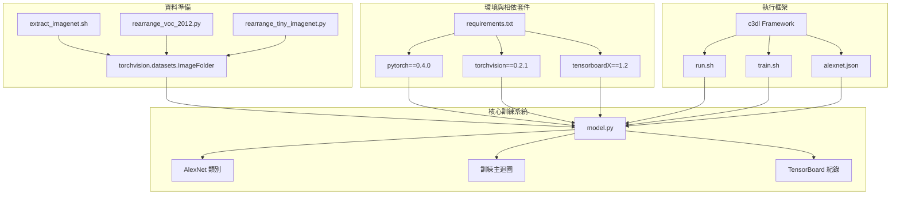
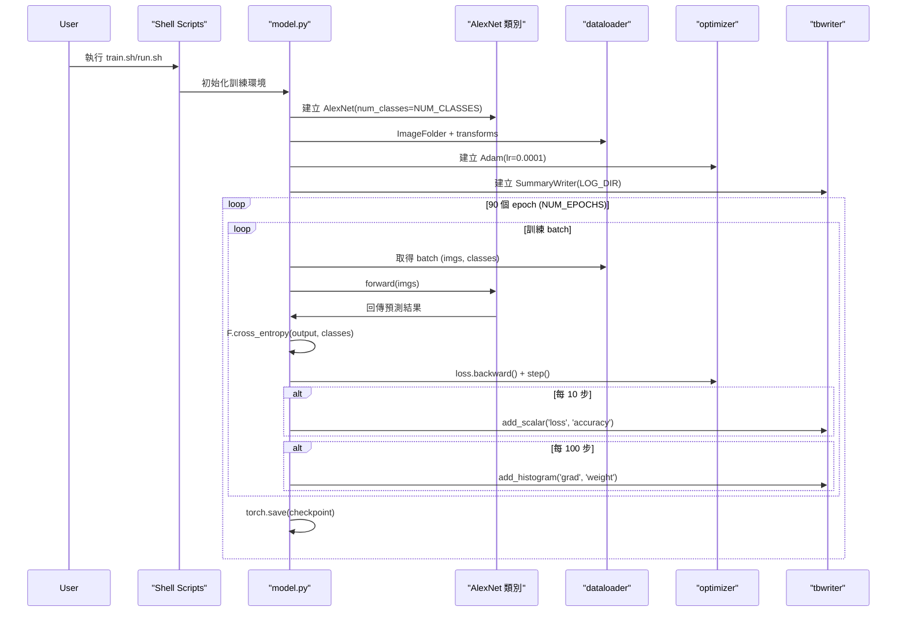
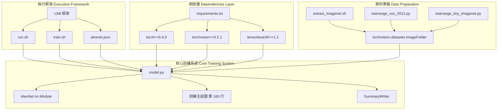
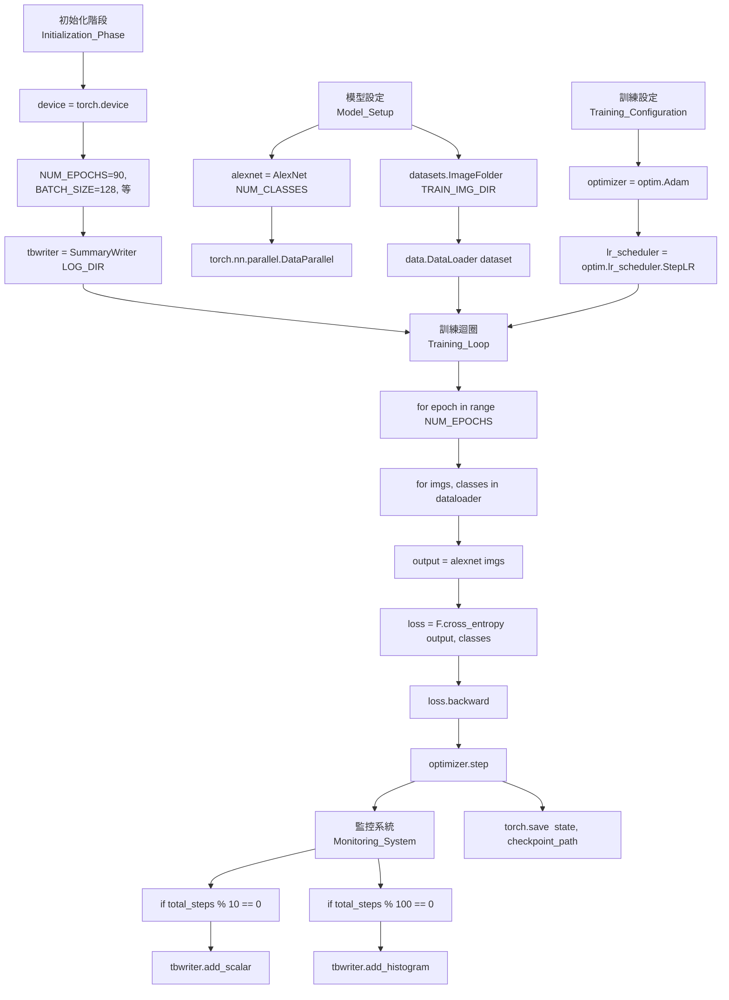
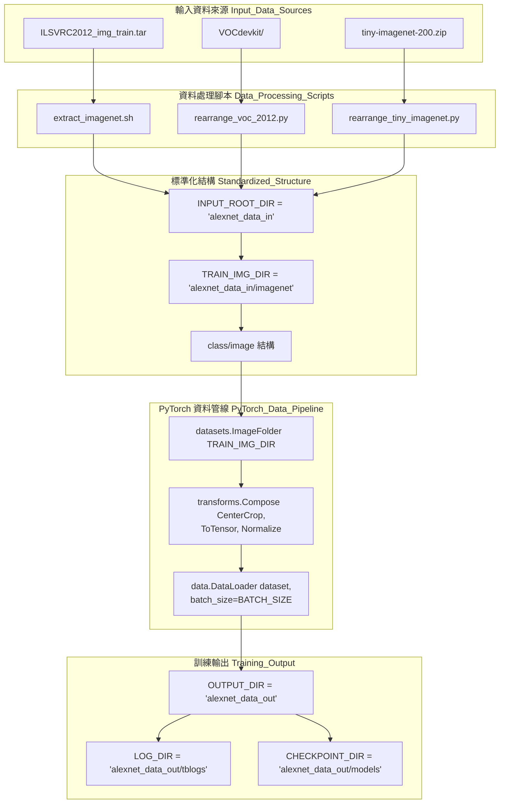

## 概述

本文件詳細介紹 AlexNet 的 PyTorch 實作版本，該專案是為了教育與研究目的所設計，根據 Krizhevsky 等人在 2012 年提出的原始論文架構進行實作，並支援 ImageNet 2012 大規模資料集訓練、多 GPU 加速與詳細實驗追蹤。

---

## 系統架構

專案主要包含四大子系統：
1. 執行框架（Execution Framework）
2. 環境與相依套件（Environment & Dependencies）
3. 資料準備（Data Preparation）
4. 核心訓練系統（Core Training System）

## 核心組件

### 主要訓練模組

`model.py` 腳本作為中央協調者，包含完整的 AlexNet 實作與訓練基礎設施。主要組件如下：

| 組件            | 程式碼實體                     | 用途                                |
|-----------------|------------------------------|-------------------------------------|
| 神經網路        | `AlexNet` 類別               | 實作 8 層 CNN 架構                  |
| 訓練設定        | `NUM_EPOCHS=90`, `BATCH_SIZE=128` | 原論文使用的超參數設定              |
| 裝置管理        | `device`, `DEVICE_IDS=[0,1,2,3]` | 支援多 GPU 訓練                     |
| 資料管線        | `datasets.ImageFolder`, `dataloader` | 標準化資料載入流程              |
| 優化策略        | `optim.Adam`, `lr_scheduler` | 訓練最佳化策略                     |
| 監控           | `SummaryWriter`, `tbwriter`  | TensorBoard 實驗追蹤                |

## 資料集支援基礎設施

系統提供三大主要電腦視覺資料集的預處理工具：

- **ImageNet ILSVRC 2012**：138GB 資料集，透過 `extract_imagenet.sh` 處理
- **PASCAL VOC 2012**：使用 `rearrange_voc_2012.py` 重新組織
- **Tiny ImageNet**：使用 `rearrange_tiny_imagenet.py` 重新結構化

所有資料集最終都會統一轉換成 `torchvision.datasets.ImageFolder` 格式，以利一致化的資料載入。

---

## 執行與配置框架

此專案整合自訂的 `c3dl` 執行框架，提供以下功能：

- Shell 腳本協調（`run.sh`, `train.sh`）
- JSON 格式設定檔（`alexnet.json`）
- 虛擬環境管理
- 自動化實驗追蹤

來源：
- `model.py` (第 20–34 行)
- `README.md` (第 22–32 行)

---

## 訓練工作流程

訓練系統從資料準備到模型部署，遵循完整的工作流程：

### 訓練執行流程

（此部分可視需求補充流程圖或詳細步驟說明）

來源：
- `model.py` (第 109–217 行)
- `model.py` (第 160–216 行)

## 主要功能

### 多 GPU 訓練支援

系統利用 `torch.nn.parallel.DataParallel`，並可設定 `DEVICE_IDS=[0,1,2,3]`，用於多 GPU 分布式訓練，使大型 ImageNet 資料集能更高效地處理。

---

### 全面性監控

雙層級日誌系統提供詳細的訓練可視化：

- **即時指標**：每 10 步記錄損失與準確率
- **詳細分析**：每 100 步記錄梯度與參數直方圖
- **實驗追蹤**：完整 TensorBoard 整合，包含 scalar 與 histogram 記錄

---

### 舊版本相容性

實作保持與 PyTorch 0.4.0 的嚴格相容性，確保基於該框架版本的研究能夠完全重現。

---

### 生產等級基礎架構

系統包含自動化 checkpoint 機制（`alexnet_states_e{epoch}.pkl`），可設定的輸出資料夾（`OUTPUT_DIR`、`CHECKPOINT_DIR`、`LOG_DIR`），以及標準化的資料預處理流程。

---

來源：
- `model.py` 第 18–34 行
- `model.py` 第 114–122 行
- `model.py` 第 174–203 行
- `model.py` 第 207–216 行
- `README.md` 第 10–18 行

## 架構總覽

這份文件提供了 AlexNet PyTorch 專案的高階系統架構總覽，重點說明核心訓練系統、資料準備工具以及執行框架如何互相整合，形成完整的機器學習訓練流程。整個架構以單一檔案的訓練實作（`model.py`）為核心，協調神經網路訓練，同時提供全面性的監控與多資料集支援。

---

如需 AlexNet 模型實作的詳細資訊，請參考 [AlexNet 模型架構](#)。  
如需執行框架的細節，請參考 [c3dl 執行框架](#)。  
如需資料集處理細節，請參考 [資料準備工具](#)。

---

## 系統組件架構

專案包含四個主要架構層，共同組成完整的 AlexNet 訓練環境：

來源：
- `model.py` 第 1–217 行
- `requirements.txt` 第 1–8 行
- `.gitignore` 第 9–15 行

---

## 訓練管線程式架構

訓練系統在 `model.py` 中以線性執行管線的方式實作，每個主要組件都對應到特定的程式碼實體：

來源：
- `model.py` 第 17–28 行
- `model.py` 第 109–122 行
- `model.py` 第 124–155 行
- `model.py` 第 160–217 行

## 資料流程與目錄架構

系統會透過標準化的處理管線，將各種資料集格式轉換為統一結構，以相容於 PyTorch 的訓練基礎架構：

來源：
- `model.py` 第 29–34 行
- `model.py` 第 124–131 行
- `model.py` 第 133–140 行
- `.gitignore` 第 3–7 行

---

## 核心整合點

此架構透過多個關鍵介面展現了組件之間的緊密整合：

| 組件                  | 整合點                  | 程式碼實體                                       | 用途                               |
|----------------------|----------------------|---------------------------------------------|----------------------------------|
| c3dl 框架            | Shell 腳本執行          | `run.sh`, `train.sh`                       | 透過外部腳本協調訓練流程          |
| PyTorch DataParallel | 多 GPU 訓練            | `torch.nn.parallel.DataParallel(alexnet, DEVICE_IDS)` | 啟用跨 GPU 平行執行              |
| TensorBoard 整合     | 即時監控              | `SummaryWriter(LOG_DIR)`                   | 提供訓練視覺化與指標追蹤          |
| ImageFolder 介面     | 資料集抽象化          | `datasets.ImageFolder(TRAIN_IMG_DIR)`      | 標準化跨資料集的資料載入          |
| Checkpoint 系統      | 狀態保存              | `torch.save(state, checkpoint_path)`       | 啟用訓練恢復及模型部署          |

系統中以 `model.py` 作為單一檔案架構，集中所有訓練邏輯，同時透過模組化的 `AlexNet` 類別定義與主要執行區塊，清楚地維持職責分離。此設計優先考量簡潔性與可重現性，勝過架構複雜性，非常適合用於教育與研究目的。

---

來源：
- `model.py` 第 40–107 行
- `model.py` 第 118–121 行
- `model.py` 第 208–216 行
- `.gitignore` 第 9–12 行

